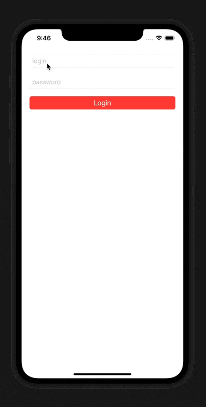

# MVVMRxSwiftTestJob
Тестовое задание на вакансию iOS Developer

## Задание
Написать приложение, с двумя экранами на архитектуре MVVM с использованием ReactiveSwift (Или RxSwift) для связывания ViewModel и View. 

### Screen 1
На первом экране текстовые формы логин, пароль и кнопка. Валидацию логина и пароля делать реактивно (кнопка недоступна, если длина введенных логина/пароля меньше 5 символов). 

### Screen 2
На втором экране список из 30 ячеек с картинками, загружаемыми из интернета через URLSession в момент срабатывания метода UITableViewDelegate - willDisplay:forRowAt и с прекращением загрузки картинки при срабатывании метода didEndDisplaying:forRowAt (можно использовать OperationQueue или ReactiveSignal, что больше зайдет). 

Срок выполнения 5 рабочих дней. 

## API
Для реализации было выбрано и использовано API: [The Rick and Morty API](https://rickandmortyapi.com/), а конкретно endpoint [/character](https://rickandmortyapi.com/documentation/#get-all-characters)

## Используемые библиотеки
* [RxSwift](https://github.com/ReactiveX/RxSwift)

## Что можно улучшить
* Добавить связывание модулей через протоколы

## Результат работы

